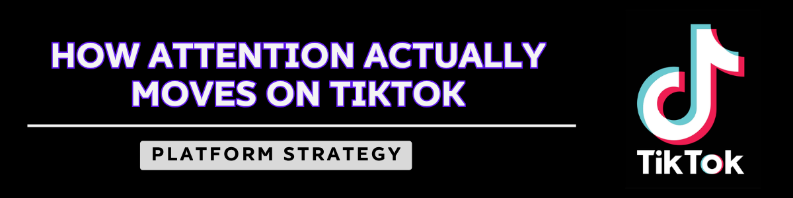

# Platform Strategy — How Attention Actually Moves on TikTok



<p align="center">
  
  
  
  
</p>

<p align="center">
  <a href="https://lylesmomportfolio.my.canva.site"><strong>View Full Write-Up</strong></a>
</p>

---

## The Thesis

> TikTok doesn’t reward good music. It rewards repeatable behavior.  
> The songs that win aren’t the best songs — they’re the most *usable* ones.

Most virality analysis stops at engagement metrics — likes, shares, views.  
This project separates:

- **Attention capture** — what stops the scroll  
- **Attention retention** — what sustains the loop  
- **Audio spread** — what travels beyond the original content  

On TikTok, a song can go viral without the artist ever posting.  
That distinction is the system.

---

## POV

Most music strategy is still built for a world where distribution is controlled.  
TikTok broke that model.

Attention is now decentralized. Audiences don’t just consume music — they *deploy* it.

The question is no longer:  
**“Do people like this song?”**

It’s:  
**“Can people use this song?”**

---

## The Attention System Framework

A five-layer model for diagnosing how music moves on TikTok.

| Layer | What It Measures | Music-Specific Signal |
|------|-----------------|----------------------|
| **01 — Hook** | First 1–3 seconds | Which part of the song anchors the moment? |
| **02 — Retention** | Watch behavior | Does it create loops or replays? |
| **03 — Engagement** | Signal strength | Comments, stitches, duets |
| **04 — Distribution** | Algorithm push | FYP injection beyond initial audience |
| **05 — Audio Portability** | Independent sound travel | Reuse, meme adoption, identity signaling |

> **Audio Portability is the differentiator.**  
> A song’s success is not just about being heard — it’s about being *used*.

---

## Case Studies

Three songs selected to isolate different system mechanisms.

### 01 — Sabrina Carpenter, *Espresso*  
**Mechanism: Lyric-as-Meme Machine**

- #3 Billboard Hot 100  
- 65 weeks charting  
- 20+ countries at #1  

**Key Insight:**  
> The most portable audio isn’t the most musical moment — it’s the most *quotable* one.

---

### 02 — Chappell Roan, *Good Luck, Babe!*  
**Mechanism: Platform-Resistant Hit**

- #4 Billboard Hot 100  
- 1B+ Spotify streams  
- 6× Platinum  

**Key Insight:**  
> Community can replace the algorithm as a distribution engine.

---

### 03 — Charli XCX, *brat*  
**Mechanism: Aesthetic-Driven Spread**

- Word of the Year — 2024  
- 80M+ SNL parody views  

**Key Insight:**  
> When audio becomes identity, it spreads as behavior — not just sound.

---

## Mechanism Comparison

| Song | Primary Mechanism | Dominant Layer | What Spread |
|------|-----------------|---------------|-------------|
| Espresso | Lyric glitch | Hook | Phrase |
| Good Luck Babe | Community | Distribution | Narrative |
| brat | Identity system | Audio Portability | Aesthetic |

---

## Pattern Synthesis

Across all cases:

- **Confusion > clarity** → drives retention  
- **Portability > quality** → drives scale  
- **Multiple ignition points > one spike** → drives longevity  
- **Comments = diagnostic layer** → reveals what’s working  

---

## How I Would Apply This (Execution Layer)

Example: Mid-tier pop artist launching a single

**Step 1 — Identify the portable moment (pre-release)**  
Select 1–2 lyric fragments or hooks that can stand alone  

**Step 2 — Seed multiple creator archetypes**  
- Humor  
- Fashion  
- POV storytelling  
- Identity signaling  

**Step 3 — Track real signals (not vanity metrics)**  
- Audio reuse  
- Stitch/duet rate  
- Watch-through loops  

**Step 4 — Diagnose via comments**  
Identify what users are actually responding to  

**Step 5 — Scale the winning behavior**  
Amplify formats that generate reuse—not just views  

---

## What I Would Do If I Ran a Label in 2026

- Design **entry points**, not just songs  
- Build **portability before streaming**  
- Treat TikTok as **distribution infrastructure**  
- Plan **multiple cultural ignition points**  
- Use **comments as real-time strategy feedback**  

---

## Why This Matters

This project reframes music success from:

**“Is this a hit?”**  
→  
**“How does this move?”**

It shows how:
- Attention behaves on modern platforms  
- Culture spreads across systems  
- Strategy must adapt to decentralized distribution  

---

## Repository Structure

```bash
platform-strategy-tiktok/
│
├── README.md
├── index.html
│
├── data/
│   ├── case-study-espresso.md
│   ├── case-study-good-luck-babe.md
│   └── case-study-brat.md
│
└── notes/
    ├── methodology.md
    └── sources.md
